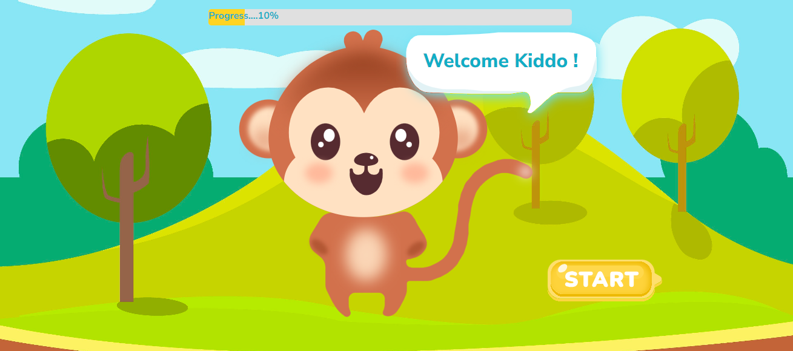
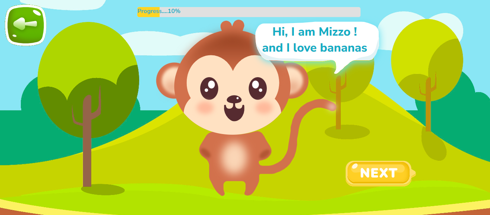
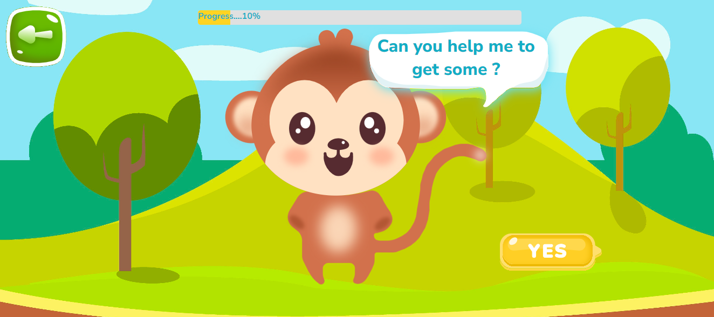
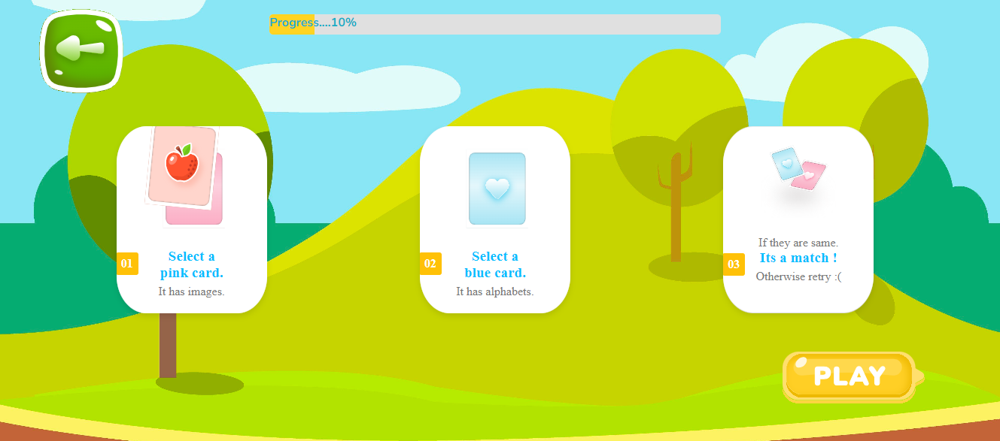
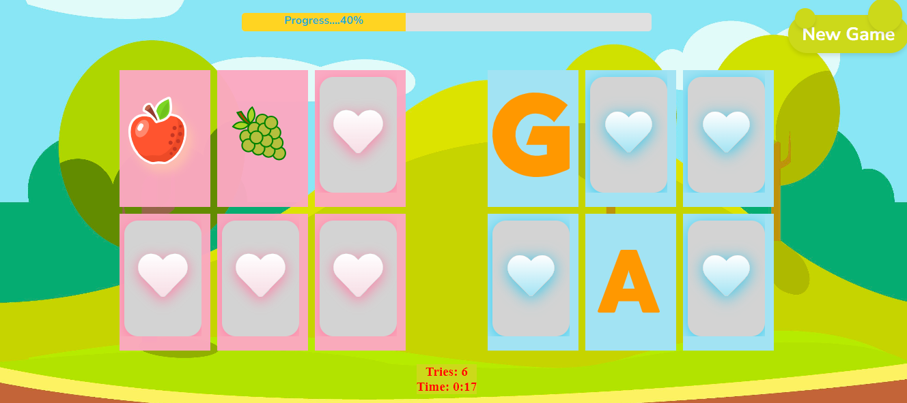
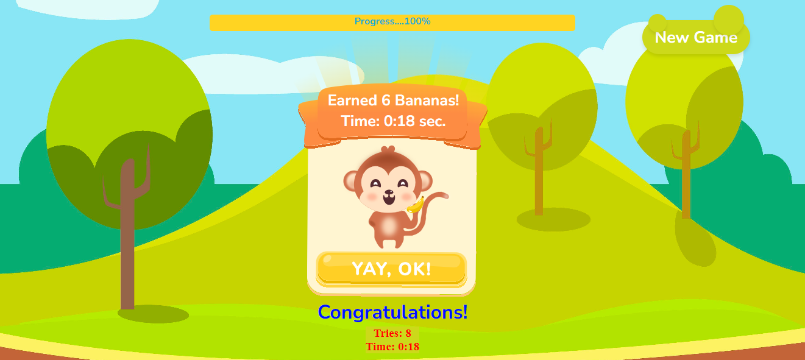

# Memory Matching Game

# Deployed Link

[Vercel Deployed Link: memory-matching-game](https://frontend-memory-matching.vercel.app/)

# Video Link

[Demo Video Link](https://drive.google.com/file/d/12y9p8AmXmy6lwbjDLItOvAoIO7_Zzw2y/view?usp=sharing)

## Description

The Memory Matching Game is an interactive web-based game where players flip cards to find matching pairs in limited time. This game is designed to be both entertaining and educational, helping to improve memory and concentration skills.

## Features

- **Welcome Screen**: Greets players and offers an option to start the game.
- **Game Board**: Displays a grid of cards, each hiding an image or pattern.
- **Card Flipping**: Players click cards to reveal them and attempt to find matching pairs.
- **Progress Bar**: Shows the player's progress by indicating the percentage of cards matched.
- **Match Feedback**: Displays a message when a match is found or if the player needs to try again.
- **End Screen**: Congratulates players upon successfully matching all pairs.

## Technologies Used

- **React**: For building the user interface.
- **TypeScript**: For type-safe JavaScript.
- **CSS**: For custom styling of the game elements.

## Installation

1. Clone the repository:

   ```sh
   git clone https://github.com/your-repo/memory-matching-game.git

   ```

2. Navigate to project dir. :

   ```sh
   cd memory-matching-game

   ```

3. Install Dependencies:

   ```sh
   npm install

   ```

4. Start the development server:
   ```sh
   npm start
   ```

## Project Screenshots

- Welcome Screen

  

- Second Screen
  
  

- Third Screen
  
  

- Instruction Screen
  
  

- Play Screen
  
  

- Last Screen

  
